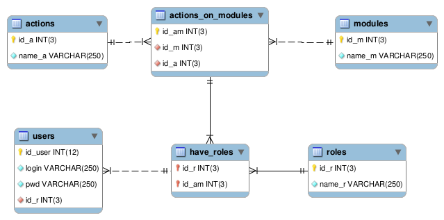

# Use of Access Management
This section shows how to install, configure, and use the Access Manager.

## Installation and Configuration
* Authorize the generation of the module in the [file](../config/app.json) config/app.json.

```json
 {
  
  "managerUserRole":true,
  
  }
```
* Add these tables to your database
 
 
> You can use this sql script

```
 DROP TABLE IF EXISTS modules ;
  CREATE TABLE modules(
     id_m INT(3) NOT NULL,
     name_m VARCHAR(250) NOT NULL,
     PRIMARY KEY (id_m)
  )ENGINE=InnoDB;

  DROP TABLE IF EXISTS actions ;
  CREATE TABLE actions(
    id_a INT(3) NOT NULL,
    name_a VARCHAR(250) NOT NULL,
    PRIMARY KEY (id_a)
  )ENGINE=InnoDB;

  DROP TABLE IF EXISTS actions_on_modules ;
  CREATE TABLE actions_on_modules(
    id_am INT(3) NOT NULL,
    id_m INT(3) NOT NULL,
    id_a INT(3) NOT NULL,
    UNIQUE(id_m, id_a),
    PRIMARY KEY (id_am)
  )ENGINE=InnoDB;

  DROP TABLE IF EXISTS roles ;
  CREATE TABLE roles(
    id_r INT(3) NOT NULL,
    name_r VARCHAR(250) NOT NULL,
    PRIMARY KEY (id_r)
  )ENGINE=InnoDB;

  DROP TABLE IF EXISTS have_roles ;
  CREATE TABLE have_roles(
    id_r INT(3) NOT NULL,
    id_am INT(3) NOT NULL,
    PRIMARY KEY (id_r, id_am)
  )ENGINE=InnoDB;

  DROP TABLE IF EXISTS users ;
  CREATE TABLE users (
    id_user INT(12) NOT NULL,
    login VARCHAR(250) NOT NULL UNIQUE ,
    pwd VARCHAR(250) NOT NULL,
    id_r INT(3) NOT NULL,
    PRIMARY KEY (id_user)
  ) ENGINE=InnoDB;


  ALTER TABLE actions_on_modules ADD CONSTRAINT FK_1  FOREIGN KEY (id_m) REFERENCES modules(id_m);
  ALTER TABLE actions_on_modules ADD CONSTRAINT FK_2  FOREIGN KEY (id_a) REFERENCES actions(id_a);
  ALTER TABLE have_roles ADD CONSTRAINT FK_3  FOREIGN KEY (id_am) REFERENCES actions_on_modules(id_am);
  ALTER TABLE have_roles ADD CONSTRAINT FK_4  FOREIGN KEY (id_r) REFERENCES roles(id_r);
  ALTER TABLE users ADD CONSTRAINT FK_5  FOREIGN KEY (id_r) REFERENCES have_roles(id_r);

  -- insert rows in  actions
  INSERT INTO actions(id_a,name_a) VALUES
   (1,'Create'),
   (2,'Read'),
   (3,'Update'),
   (4,'Delete'),
   (5,'Print');
```
## Use the Access Manager
* After the generation and implementation of an authentication system, modify function the run() in : app / app.php.
> here is an example
```
    <?php
    namespace app;
    use entities\User;
    use additionals\user_role\ManagerUserRole;

    /**
     * Application representation
     * @author PhpGenerator (https://github.com/leplutonien/php_generator)
     */
    class App extends \lib\Application{

        public function __construct(){
            parent::__construct();
        }

        /**
         * run the application
         */
        public function run(){
            if(!$this->User()->isAuthenticated()){
                if($this->httpRequest()->requestURI() != '/login'){
                    $this->httpResponse()->redirect("/login");
                }
            }else{
                if($this->httpRequest()->requestURI() == '/login') {
                    $this->httpResponse()->redirect("/");
                }
                $user = User::findByAttribute(
                array(
                'id_user' => $this->User()->getAttribute('id_user')
                )
                )[0];

                $m = new ManagerUserRole($user);
            }
            $controller = $this->getController();
            $controller->execute();
            $this->httpResponse->setPage($controller->page());
            $this->httpResponse->send();
        }
    }
    ?>
  ```
* Then, before opening a page, it is checked whether the user has access to it

> Example

```
  <?php
  namespace app\modules\posts;
  use additionals\user_role\ManagerUserRole;
  use entities\Posts;

  /**
  * Controller of posts
  *@author PhpGenerator (https://github.com/leplutonien/php_generator)
  */
  class PostsController extends \lib\BackController{

   public function executeGetAll(){
       $m = ManagerUserRole::getManagerUserAccess();
       $m->canExcuteOneofActions(1,array(1,2));

       $this->page->addVar('title','Get All Posts ');
       $posts = Posts::findAll();

       $this->page->addVar('posts',$posts);
       $this->page->setLayout('layout.php');
   }

   /**
    *  return a specific post
    */
   public function executeGetPost(){
       $id = $this->app->httpRequest()->getData('id_post');

       $posts = Posts::findByAttribute(array(
           'id' => $id
       ));

       if(is_null($posts)){
           $this->app->httpResponse()->redirect404($this->app);
       }

       $this->page->addVar('post',$posts[0]);
       $this->page->addVar('title','one post');
       $this->page->setLayout('layout.php');
   }
  }
  ?>
  ```
